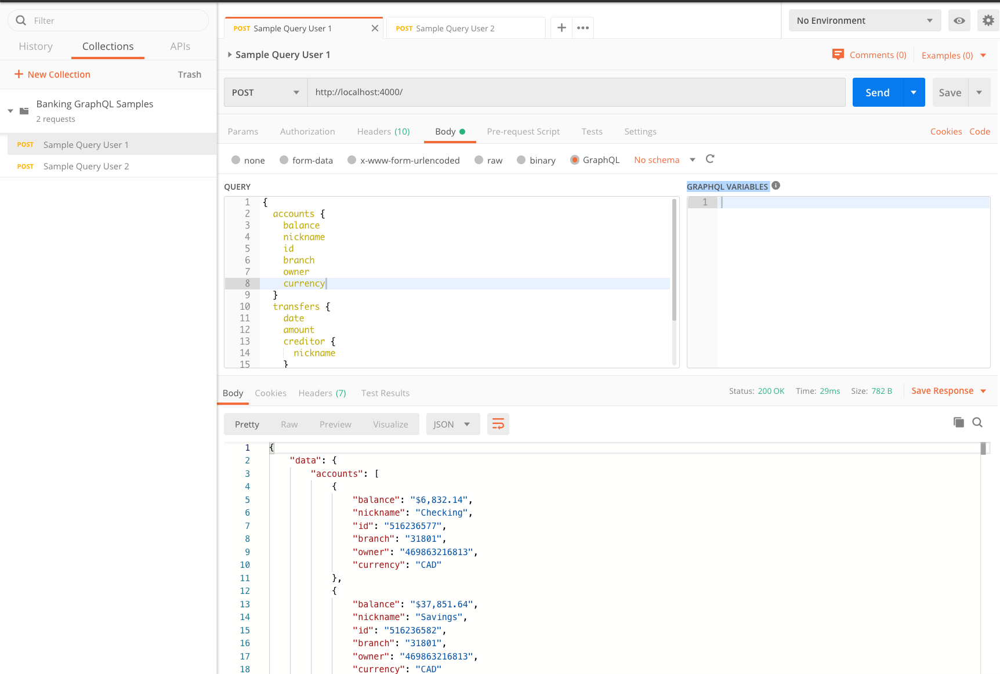

# GraphQL Access Control banking sample
Example Apollo GraphQL service with sample open banking data which implements access control rules at the resolver level by reading a requester subject de-referenced from an incoming OAuth token and populated into the ApolloServer context.

This illustrates basic access control in which the banking accounts returned by the GraphQL queries are only the ones that are associated with the identity of the requester of the query as identified by the incoming OAuth token attached to the query. Skip to the bottom of this readme for instructions on how to run this locally.

In order to get to the requester subject, the `express.Request` is first added to the `ApolloServer` context (see `index.js`):
 ```
// instantiate Apollo express server with a hook to incorporate incoming request inside the transaction context
const server = new ApolloServer({
  typeDefs,
  resolvers,
  context: ({ req }) => {
    // add the request to the context
    const request = req;
    return {request};
  },
});
```
The hardcoded banking data is populated with object that have an _owner_ attribute that can be used to match the ownership of the bank account with the subject of the requester (see `data.js`):
```
exports.accounts = [
    {
        id: '516236577',
        branch: '31801',
        currency: 'CAD',
        type: 'Checking',
        balance: '$6,832.14',
        owner: '469863216813',
        nickname: 'Checking',
    },
    {
        id: '516236582',
        branch: '31801',
        currency: 'CAD',
        type: 'Savings',
        balance: '$37,851.64',
        owner: '469863216813',
        nickname: 'Savings',
    },
...
];
```

The GraphQL resolver implements both the de-referencing of the subject from the incoming token (via the request in the context) as well as the matching of which elements from the data should be returned based on the identity of the requester.
Because the de-referencing of the subject can involve an outbound call to an OAuth token introspection endpoint, the GraphQL resolver is implemented in async mode and you need to `await` on the method which looks up the subject from the token (a Node.JS quirk I'm still getting used to as a Java developer).
```
const resolvers = {
  Query: {
    accounts: async (root, args, context) => {
      await contextToSubject(context);
      console.log("returning accounts for user " + context.subject);
      // iterate across accounts, only return matching for that user
      let i;
      let output = [];
      for (i = 0; i < data.accounts.length; i++) {
        // add to output only if owner matches
        // this statement is key to the authorization decision illustrated in this example
        if (data.accounts[i].owner.localeCompare(context.subject) == 0) {
          output[output.length] = data.accounts[i];
        }
      }
      console.log("" + output.length + " items");
      return output;
    },
    transfers: async (root, args, context) => {
      await contextToSubject(context);
      console.log("returning transfers for user " + context.subject);
      // iterate across transfers, only return matching for that user
      let i;
      let output2 = [];
      for (i = 0; i < data.transfers.length; i++) {
        // add to output only if owner of creditor account matches
        // this statement is key to the authorization decision illustrated in this example
        if (data.transfers[i].creditor.owner.localeCompare(context.subject) == 0) {
          output2[output2.length] = data.transfers[i];
        }
      }
      console.log("" + output2.length + " items");
      return output2;
    },
  },
};
```
Two separate identity subject de-referencing methods are implemented. You can uncomment the one you want to use or add your own. The first de-referencing method makes an outbound call to a token introspection endpoint on Ping Federate to retrieve attributes associated with the incoming token. The second alternative parses fake tokens and retrieve a subject from it. This alternative is provided for cases where you want to avoid any dependencies (such as a token service) to just work on the GraphQL implementation.
```
// ==== TOKEN INTROSPECTION ====
// Introspection for incoming tokens with Ping Federate's OAuth token introspection endpoint
// This is kept simple, and the call out is made out each time, an obvious optimization would
// be to cache introspection results to avoid calling each time
// the Ping Federate oauth introspection endpoint typically returns one of the following two responses:
// 1.                      {
//                           "Username" : "469863216813@example.com",
//                           "active" : true,
//                           "OrgName" : "PingIdentity",
//                           "token_type" : "Bearer",
//                           "exp" : 1582660570,
//                           "client_id" : "graphql_client"
//                         }
//
// 2. (in case of failure) {
//                           "active" : false
//                         }
//
async function tokToSubjectIntrospection(tok) {
  try {
    let http_promise = getPingFedPromise(tok);
    // response_body holds response from server that is passed when Promise is resolved
    let response_body = await http_promise;
    const introspection_response = JSON.parse(response_body);
    if (!introspection_response.active) {
      console.log("Token introspection: The incoming token is invalid or in not active");
      // You may want to return a 401 here
      return "not authenticated";
    } else if (introspection_response.active) {
      // isolate subject
      const username = introspection_response.Username;
      const subject = username.substring(0, username.indexOf('@'));
      return subject;
    } else {
      console.log("Token introspection: Unexpected token introspection response: " + response_body);
      return "Introspection failed";
    }
  } catch(error) {
    // Promise rejected
    console.log(error);
    return "Introspection failed";
  }
}

// SELECT TOKEN MODE HERE
// This is the function which dereferences the requester subject from the incoming token
// you could do this many ways such as decode a JWT or call an external userInfo (e.g. PingFederate)
// endpoint and cache the results from that userInfo endpoint
async function tokToSubject(tok) {
  // Two different ways to accomplish this are implemented, uncomment one or the other

  // Alternative 1
  return await tokToSubjectIntrospection(tok);

  // Alternative 2
  // return tokToSubjectFakeToks(tok);
}

// dereference the requester subject from the incoming request
async function contextToSubject(context) {
  // looking for token from http header authorization using value pattern "Bearer _token_"
  const req = context.request;
  const token = req.headers.authorization || '';

  // Valid token require authorization value to be longer than 7 because it starts with "Bearer "
  if (token.length > 7) {
    // isolate the token from the authorization header value
    let bearertok = token.substring(7);
    // resolve your user subject from the token
    context.subject = await tokToSubject(bearertok);
  } else {
    context.subject = "no subject present";
  }
}
``` 
## Running the GraphQL server sample

Step 1 - Clone repo
```sh
git clone https://github.com/flascelles/graphql-access-control
cd graphql-access-control
```
Step 2 - Initialize a new Node.js project:
```
npm init --yes
```
Step 3 - Run the following command to install both of these dependencies and save them in your project's node_modules directory:
```
npm install apollo-server graphql
```
Step 4 - Start Apollo server:
```
node index.js
```
Result - You should see the following output:
```
🚀 Server ready at http://localhost:4000/
```

## Querying the server using Postman

You can query the GraphQL API by using the Postman collection provided. Open Postman, click `Import`, click `Choose Files` and select the file from this repo `Banking GraphQL Samples.postman_collection.json` 

Two Sample GraphQL queries are provided (one for each sample user in the hardcoded data). You can modify the parameters of the Query by opening the Request Body field in Postman.



